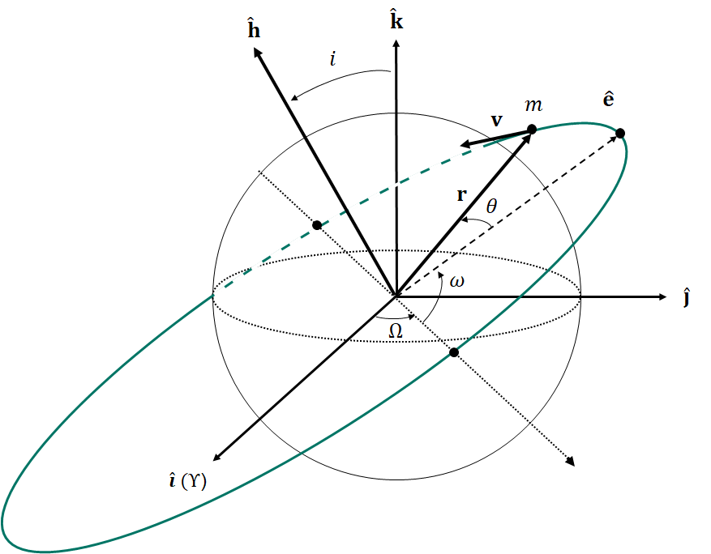

# AE470 - 01: Orbital Mechanics

Spring 2025  
Monday 4:00pm - 6:30pm  
178 CAMP Building  

Instructor: Jeff Walton, Ph.D.  
Email: <jwalton@clarkson.edu>  
Office: CAMP 364  

TA: Saad Yousuf  
Email: <yousufsi@clarkson.edu>  
Office: CAMP 272  

## Course Description

This course provides an overview of the fundamentals of orbital mechanics. Beginning from kinematics and rigid body dynamics, students are introduced to topics in orbital and attitude dynamics and control. In orbital dynamics and control, core topics covered include: the two-body problem, orbital motion, Kepler’s Laws, orbital elements, orbital perturbations, orbital maneuvers, interplanetary trajectories, and the restricted three-body problem. In attitude dynamics and control, core topics covered include: attitude stabilization, torques on a spacecraft, torque-free motion, spin and dual-spin stabilization, gravity-gradient stabilization, and active attitude control.

## Units

3 credits

## Prerequisites

ES 223: Rigid Body Dynamics  
AE/ME 324: Dynamical Systems  
MA 232: Elementary Differential Equations  

## Textbook

H.D. Curtis; Orbital Mechanics for Engineering Students; Butterworth-Heinemann, 4th Ed, 2021.

## References

   R.R. Bate, D.D. Mueller, J.E. White, W.W. Saylor; Fundamentals of Astrodynamics, Dover, 2nd Ed, 2020.  

   R.H. Battin; Introduction to the Mathematics and Methods of Astrodynamics, AIAA, Rev. Ed, 1999.  

   H.D. Curtis; Orbital Mechanics for Engineering Students; Butterworth-Heinemann, 4th Ed, 2021.

   A.H.J. de Ruiter, C.J. Damaren, J.R. Forbes; Spacecraft Dynamics and Control: An Introduction; Wiley, 2013.

   V.G. Szebehely; Adventures in Celestial Mechanics; University of Texas Press, 1989.  

## Course Objectives

   CO1: Apply mathematical concepts from kinematics and rigid body dynamics to describe the position, attitude, and equations of motion of a rigid spacecraft, expressed in arbitrary reference frames.  

   CO2: Analytically solve problems in orbital dynamics and control, particularly with respect to two-body orbital motion, orbit determination, orbital maneuvers, orbital perturbations and interplanetary trajectories.  

   *CO3: Analytically solve problems in attitude dynamics and control, particularly with respect to attitude stabilization, disturbance torques, torque-free attitude motion, and active spacecraft attitude control.  

## Topics

1. Introduction
2. Vector and Matrix review
   1. Vector Arithmetic
   2. Dot Product
   3. Cross Product
   4. Rotation Matricies
3. Numerical Integration
4. Kinematics Review
5. Time and Coordinate Systems
6. The Two-Body Problem
   1. Newton's Laws
   2. Equations of Motion
   3. Constants of Motion
   4. Kepler's Laws
   5. Orbital Elements
7. Orbit Determination
8. Orbital Maneuvers
9. Interplanetary Trajectories
10. Orbital Perturbations
11. Restricted Three-Body Problem

## Topic Schedule and Assignments

* This calendar is tentative.

| Week  | Date | Topics | Graded Activity |
| ----- | ---- | ------ | ----------- |
| 1  | Jan 13 | Introduction, Python Environment, Vector and Matrix Review |  |
| 2  | Jan 20 | Numerical Integration, Two-Body EOM |  |
| 3  | Jan 27 | Two-Body Constants of Motion |  |
| 4  | Feb 3 | Keplerian Orbits, Two-Body Orbital Elements |  |
| 5  | Feb 10 | Keplerian Orbits, Time of Flight |  |
| 5  | Feb 11 |  | Assignment #1 - Numerical Integration |
| 6  | Feb 17 | Class Cancelled | STK - Level 1 |
| 7  | Feb 24 | Reference Frames, Classical Orbital Elements  |  |
| 7  | Feb 25 |  | Assignment #2 - Two-Body Problems |
| 8  | Mar 3 | Time, Date, Ground Tracks; Orbital Maneuvers |  |
| 8  | Mar 4 |  | Assignment #3 - p,v <=> Orbital Elements |
| 9  | Mar 10 | Orbital Maneuvers, Orbit Determination |  |
| 9  | Mar 11 |  | Assignment #4 - STK Hohmann Transfer |
| 10  | Mar 17 | *Spring Recess (No Class)* |  |
| 11  | Mar 24 | Interplanetary Trajectories |  |
| 11  | Mar 25 |  | Assignment #5 - STK Orbital Maneuvers |
| 12  | Mar 31 | Orbital Perturbations  |  |
| 12  | Apr 1 |  | Assignment #6 - STK Interplanetary Trajectory |
| 13  | Apr 7 | Circular Restricted Three-Body Problem, Cislunar, STK Mission |  |
| 13  | Apr 8 |  | Assignment #7 - STK Sun-Synchronous Orbit |
| 14  | Apr 14 | Project Presentations | STK - Mission |
| 14  | Apr 15 |  | Assignment #8 - STK CR3BP |
| 15  | Apr 21 | Project Presentations | STK - Mission |
| 16  | May 6 | **Project Write-Up Due** | STK - Mission |

## Grading

| Graded Activity | Percent of Final Grade | Part Percent |
| --------------- | ---------------------- | ------------ |
| Assignments (x8) | 80% |  |
| Project | 20% |  |
| STK - Level 1 |  | 5% |
| STK - Mission |  | 15% |
